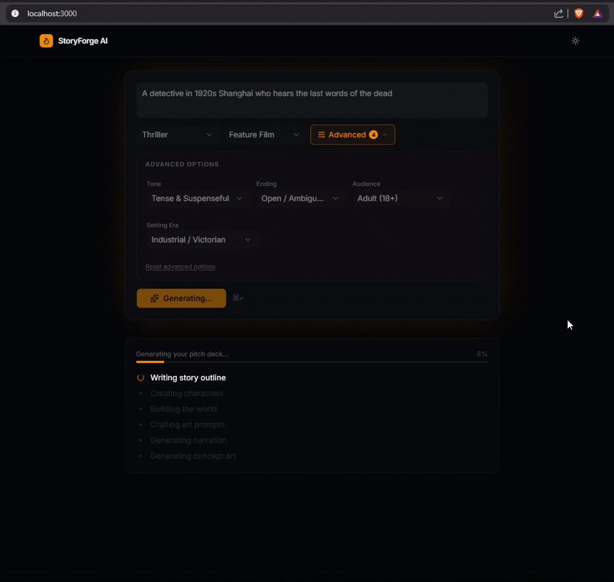
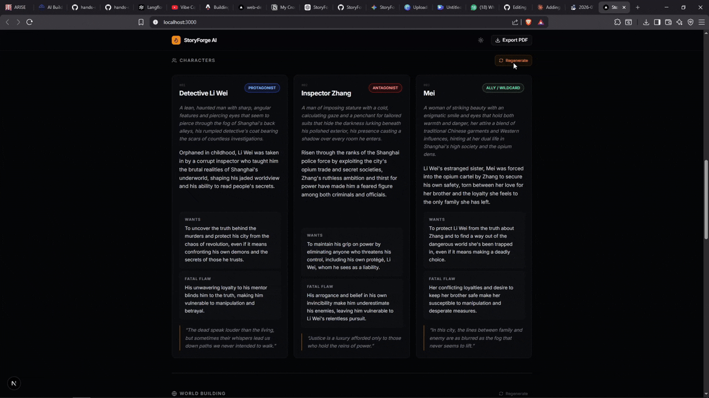

<h1>
  StoryForge AI
  <sub>
    <sup> 🤖 Multi-Agent Creative Pipeline </sup>
  </sub>
</h1>

> **IBM AI Builders Challenge — July 2026 · Creative Industries theme**

**One sentence becomes a complete story pitch deck — outline, characters, world-building, concept art, audio narration, and a downloadable PDF — powered by IBM Granite**


## The Problem

Creators, writers, indie game designers, tabletop RPG builders, filmmakers have sparks of ideas constantly. Turning a concept into a shareable, presentable pitch takes hours. writing a premise, inventing characters, designing the world, sourcing placeholder art, and formatting it all into something you can hand to a collaborator.

Existing AI tools solve these pieces in isolation across different tabs. Nobody stitches them into one coherent, downloadable creative document automatically.


## The Solution

StoryForge AI takes a single line of user input — e.g. *"A blind cartographer discovers the world is flat"* — and generates a complete, publication-quality **Story Pitch Deck** in under 60 seconds:

## 🎯 Watch It In Action
 


### Step-by-Step Pipeline

<p align="center">
  
</p>
 
*Clear, real-time feedback on what AI is running at each moment.*


---
### Fully Generated Pitch Deck

<p align="center">
  
</p>
 

*Watch a complete pitch deck come together in real-time — story, characters, images, and world-building all coherently generated.*
 
---
 
## 🔧 Advanced Features
 
### Per-Section Regeneration
 


<p align="center">
  
</p>
 
*Don't like a character or the story direction? Click **Regenerate** on any section. The AI re-runs just that step using the current deck as context. One-click **Rollback** if you want to keep the original.*


 ---
### Per-Image Regeneration
 

<p align="center">
  
</p>
 
*Hover any of the 4 concept art images → click the regenerate icon. Granite crafts a new art prompt, FLUX generates a new image. Keep or rollback with a single click.*

 ---
### One-Click PDF Export
 

<p align="center">
  
</p>
 
*Click **Export PDF** in the header. Your styled, publication-ready pitch deck downloads as A4 with all images, character profiles, world-building, and narration credits.*
 
---


| Output | What's generated |
|---|---|
| **Story outline** | Title, logline, premise, three-act structure, theme, tone |
| **3 Character profiles** | Name, role, physical description, backstory, motivation, fatal flaw, defining quote |
| **World building** | Setting name, geography, rules/magic/tech system, cultural flavour, atmosphere |
| **4 Concept art images** | FLUX-generated, described by Granite from the actual story content |
| **Audio narration** | ElevenLabs TTS for each of the 3 acts — voice tuned per genre |
| **PDF export** | Styled A4 pitch deck with all content and images, one-click download |

Everything stays **coherent** — character names, the world name, visual art prompts, and narration all reference the same story, because every step of the AI chain receives the previous outputs as context.

---

## 🧠 Multi-Agent AI Architecture

StoryForge AI is built as a **multi-agent creative pipeline**. Each specialized AI agent is responsible for one creative task and passes structured output to the next agent, ensuring consistency across the entire pitch deck.

```
User Prompt + Story Options
        │
        ▼
   Story Agent     ← IBM Granite 4 (Granite 3.3 Instruct via watsonx.ai
        │          → title, logline, premise, 3-act outline, theme, tone
        │                 
        ├──────► [Parallel] Narration Agent
        │          → ElevenLabs TTS
        │          → Generates 3-act narration
        │
  Character Agent  ← IBM Granite 4 (receives story context)
        │          → Generates 3 character Profiles with name/role/backstory/motivation/flaw/quote
        ▼
   World Agent     ← IBM Granite 4 (receives story + character context)
        │          → settingName, geography, rulesOrSystem, culture, atmosphere
        ▼
Art Prompt Agent   ← IBM Granite 4 (receives all above)
        │          → 4 cinematic image prompts referencing real names + locations
        │
        ├─────► [Parallel] Image Generation Agent  
        │          → Pollinations.ai (FLUX model, 768×768) 
        │          → 4 concept art images, rendered as they arrive
        ▼
Pitch Deck assembled in-browser
        │
        ▼
PDF Export (jsPDF, client-side, no server round-trip)
```

### Why Sequential Chain (not LangGraph)

A sequential chain — prompt 1 → output 1 → prompt 2 that includes output 1 as context — achieves the same coherence as a multi-agent pipeline for this use case. LangGraph adds graph state management and tool registration complexity that buys nothing extra for a solo-built creative generation flow. Simplicity is a feature, the architecture is readable in five minutes and the demo is reliable.

---

## Feature List

### Core
- **Single-prompt generation** — one sentence generates the full deck
- **8 genre presets** — Fantasy, Sci-Fi, Thriller, Horror, Romance, Historical, Mystery, Adventure
- **Story scope selector** — Short Story, Feature Film, TV Pilot, Video Game, Book Series / Epic
- **Advanced options panel** — Tone, Ending type, Target audience, Setting era (all optional)
- **6-step animated progress bar** — shows exactly which AI is running at each moment
- **Progressive reveal** — each section appears as its data arrives; images load one-by-one
- **Dark mode** — full theme toggle in the header
- **Example prompt chips** — 4 clickable concepts on the landing page for instant demo

### Regenerate & Rollback
- **Per-section regenerate** — Story, Characters, and World each have a Regenerate button; Granite re-runs only that step using the current deck as context
- **Per-image regenerate** — hover any of the 4 concept art images → Regenerate icon; Granite rewrites the art prompt for that slot, then FLUX generates a new image
- **Rollback / Keep UX** — every regeneration (text and image) snapshots the previous version; a "Roll back / Keep new" banner lets you undo with one click
- **Manual audio refresh** — after story regeneration, stale audio is cleared; a "Regenerate Audio" button re-runs ElevenLabs narration for the updated acts

### Landing Page
- **DemoDeck** — a static hardcoded sample pitch deck is visible on the landing page so the output quality is immediately apparent without waiting for a generation

### Audio Narration
- **Per-genre voice profiles** — each genre maps to a distinct ElevenLabs voice (e.g. Thriller → Harry, Fantasy → George, Romance → Sarah)
- **Per-act dynamics** — stability and style parameters are tuned per act (setup vs. conflict vs. resolution)
- **Client-side retry** — two sweeps across the 3 acts with 2-second gaps; eliminates silent acts caused by server-side timeout issues

### Export
- **Styled A4 PDF** — dark header band, amber accent lines, character Wants/Flaw two-column layout, all 4 images in a 2×2 grid, per-page footer
- **Filename derived from title** — e.g. `the-edge-of-everything-pitch-deck.pdf`

---

## Tech Stack

| Layer | Technology |
|---|---|
| Frontend + API routes | Next.js 15 (App Router), TypeScript, Tailwind CSS, shadcn/ui |
| LLM | IBM Granite 4-h-small via `@ibm-cloud/watsonx-ai` SDK |
| Image generation | Pollinations.ai (FLUX model, 768×768, free, no API key) |
| Audio narration | ElevenLabs TTS (`eleven_turbo_v2_5`) |
| PDF export | jsPDF (client-side, no server round-trip) |
| Dev tooling | IBM Bob (primary development tool — see below) |

---

## Local Setup

### Prerequisites

- Node.js 18+
- An IBM watsonx.ai account with a Project ID and API key
- An ElevenLabs account with an API key (free tier is sufficient for demo)

### 1. Clone and install

```bash
git clone <repo-url>
cd storyforge-ai

.\install.ps1   #run this for Windows OS

bash install.sh  #run this for macOS/Linux OS

npm install
```

### 2. Configure environment variables

Copy the example file and fill in your keys:

```bash
cp .env.local.example .env.local
```

Edit `.env.local`:

```env
# IBM watsonx.ai
WATSONX_API_KEY=your_watsonx_api_key_here
WATSONX_PROJECT_ID=your_watsonx_project_id_here

# ElevenLabs TTS
ELEVENLABS_API_KEY=your_elevenlabs_api_key_here

# Pollinations.ai — no key needed, leave blank
```

> **Where to get keys:**
> - watsonx.ai API key: IBM Cloud → Manage → Access (IAM) → API keys
> - watsonx.ai Project ID: watsonx.ai → Projects → your project → Manage → General → Project ID
> - ElevenLabs: elevenlabs.io → Profile → API Keys

### 3. Run

```bash
npm run dev
```

Open [http://localhost:3000](http://localhost:3000).

### 4. Generate your first pitch deck

1. Type a story concept (e.g. *"Pirates in space who worship a dying star"*)
2. Select a genre
3. Optionally open the **Advanced** panel to set tone, era, ending type, or audience
4. Click **Generate Pitch Deck**
5. Watch the 6-step pipeline run — text → audio → images
6. Click any audio play button to hear the narration
7. Hover over a concept art image and click the regenerate icon to get a new version
8. Click **Export PDF** in the header to download the full pitch deck

---

## Project Structure

```
storyforge-ai/
  app/
    page.tsx                     ← Main UI — full pipeline wiring, regenerate/rollback state
    layout.tsx
    api/
      generate/route.ts          ← POST: sequential Granite chain (story→chars→world→artPrompts)
      images/route.ts            ← POST: Pollinations FLUX image generation
      narrate/route.ts           ← POST: ElevenLabs TTS — per-genre voices, per-act dynamics
      regenerate/route.ts        ← POST: per-section Granite regen (story|characters|world|imagePrompt)
  components/
    PromptInput.tsx              ← Textarea + genre/scope/advanced selectors
    LoadingPipeline.tsx          ← 6-step animated progress indicator
    StorySection.tsx             ← Story outline + per-act audio players + regen/rollback
    CharacterCard.tsx            ← Character card + CharactersSection with regen/rollback
    WorldSection.tsx             ← World building display with regen/rollback
    ArtGrid.tsx                  ← 2×2 image grid + per-image regen + rollback + spinner overlay
    ExportButton.tsx             ← PDF export trigger (lazy-loaded jsPDF)
    DemoDeck.tsx                 ← Static hardcoded sample output on landing page
  lib/
    granite.ts                   ← watsonx.ai client + generateJSON with retry + parseJSON
    prompts.ts                   ← All prompt templates (story/chars/world/art/singleArt)
    replicate.ts                 ← Pollinations.ai FLUX client — 768×768, retry, base64 output
    pdfExport.ts                 ← jsPDF styled A4 pitch deck renderer
    types.ts                     ← TypeScript interfaces + GENRES/TONES/ERAS/ENDINGS constants

```

---

## How IBM Bob Was Used

IBM Bob was the **primary development tool** for this project — every significant piece of code was built with Bob. This is a requirement of the IBM AI Builders challenge and also genuinely how the app was built.

### What Bob built, session by session

| Phase | What Bob built |
|---|---|
| **Phase 1 — Foundation** | Full Next.js scaffold, `lib/types.ts` (all TypeScript interfaces and constants), `lib/prompts.ts` (all 4 prompt templates with JSON schemas), `lib/granite.ts` (watsonx.ai client, retry logic, JSON parsing), `lib/replicate.ts` (Pollinations FLUX client), `app/api/generate/route.ts` (sequential chain), `app/api/images/route.ts` |
| **Phase 2 — Features** | `app/api/narrate/route.ts` (ElevenLabs TTS with per-genre voice profiles and per-act dynamics), advanced `StoryOptions` type with 6 fields, all advanced prompt engineering (tone/ending/audience/era constraints baked into every Granite call), `lib/pdfExport.ts` (full styled A4 with images) |
| **Phase 2 — UI** | All UI components: `PromptInput.tsx` (genre/scope/advanced panel), `LoadingPipeline.tsx`, `StorySection.tsx`, `CharacterCard.tsx`, `WorldSection.tsx`, `ArtGrid.tsx`, `ExportButton.tsx`, `app/page.tsx` (full wiring, dark mode, error states) |
| **Phase 3 — Bug fixes** | Audio fix (server-side `sleep()` timeout → client-side 2-sweep retry), image display fix (`aspect-square` + `object-cover`), PDF layout fix (theme/tone line overflow), image prompt revert |
| **Phase 3b — Beyond PRD** | `app/api/regenerate/route.ts` (per-section Granite regen endpoint), `singleArtPrompt` template, per-section Regenerate + Rollback/Keep UX across all 3 text sections and all 4 image slots, `DemoDeck.tsx` static component, `AbortController` wiring, parallel audio+image lane architecture |

### How Bob was used in practice

- **One task per concern** — each phase and each major component was a separate Bob task, keeping context tight and outputs focused.
- **Iterative refinement** — Bug fixes were their own sessions. Bob was shown the exact error (e.g. `Act 2 + Act 3 audio silent`) and the root cause was diagnosed and fixed without touching unrelated code.
- **Prompt engineering collaboration** — The `lib/prompts.ts` templates evolved through Bob sessions, with each iteration producing better-structured JSON outputs from Granite.
- **Architecture decisions first** — The sequential chain vs. LangGraph decision, the jsPDF vs. html2canvas decision, and the Pollinations vs. Replicate switch were all reasoned through with Bob before writing a line of code.

---

## Challenge Alignment

| Judging Criterion | How StoryForge AI addresses it |
|---|---|
| **Technical Execution** | Sequential LLM prompt chain with structured JSON outputs; parallel audio+image lanes; per-section regeneration with rollback; server-side API routes with proper secret management; type-safe throughout with `tsc --noEmit` passing at 0 errors |
| **Innovation** | Multi-agent AI architecture- Combines structured story generation + coherent world-building + AI concept art + per-act audio narration + one-click styled PDF into a single seamless flow — and adds per-section + per-image regeneration with rollback UX |
| **Challenge Fit** | Directly embodies "AI as a creative partner for creative industries" — Granite maintains creative coherence across five interdependent outputs |
| **Feasibility** | Single repo, three API keys, zero infrastructure — runs locally with `npm run dev` |
| **Real-World Impact** | Writers, game designers, and indie creators spend hours creating pitches manually. This turns that into 60 seconds and produces a shareable, professional document |

---


*Built for the IBM AI Builders — July 2026 Challenge: Reimagine Creative Industries with AI.*
*Primary dev tool: IBM Bob.*
